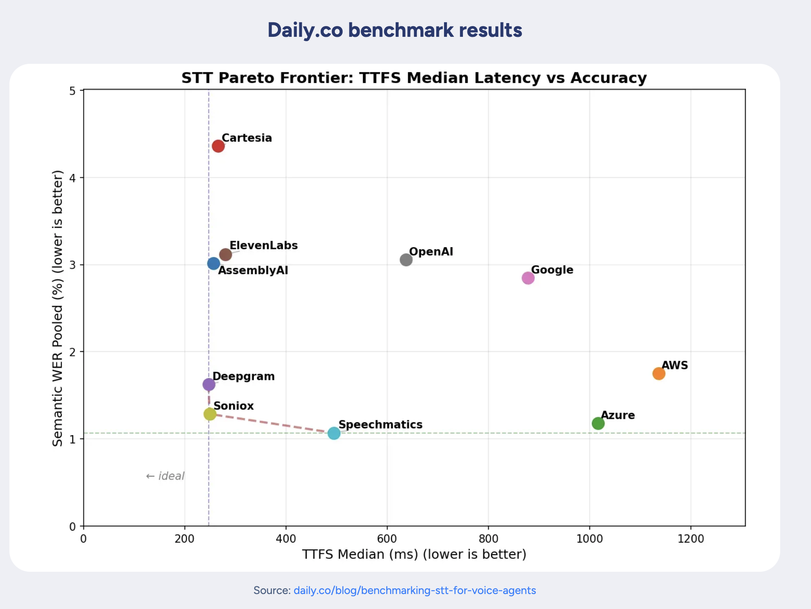

# Soniox Captions for OBS

[English](README.en.md) | **한국어**

Soniox API를 사용한 OBS Studio **실시간 자막 + 번역** 플러그인입니다.
한국어로 말하면 자막이 표시되고, 동시에 영어(또는 다른 언어)로 번역된 자막도 함께 표시됩니다.

---

## Soniox란?

[Soniox](https://soniox.com)는 업계 최고 수준의 실시간 음성 인식(STT) API입니다.

- **속도**: 중간 지연시간 249ms — 업계 최상위권
- **정확도**: 단어 오류율(WER) 1.29% — 최고 수준의 정밀도
- **60개 이상 언어 지원**: 한국어, 일본어, 중국어 등 비영어권에서도 동일한 정확도와 속도 제공. 대부분의 경쟁사가 영어 외 언어에서 정확도가 급격히 떨어지는 것과 차별화
- **코드스위칭**: 문장 중간에 언어를 바꿔도 자동 인식 (예: 한국어 → 영어 전환)
- **실시간 번역**: 3,600개 이상 언어 조합의 스트리밍 번역
- **고급 엔드포인팅**: 단순 침묵이 아닌 어조와 의미를 분석하여 발화 완료 시점을 정확히 판단


*출처: [Daily.co (Pipecat) STT 벤치마크](https://daily.co/blog/benchmarking-stt-for-voice-agents)*

> *"대부분의 업계 리더들은 영어 우선(English-first)입니다. 비영어 오디오에서는 정확도가 급락하고 지연시간이 급증합니다. Soniox는 어떤 언어에서든 동일한 최고 수준의 정확도와 속도를 제공하는 유일한 음성 API입니다."*
> — [Soniox Blog](https://soniox.com/blog/soniox-named-best-in-class-for-voice-agents)

## 주요 기능

- **실시간 음성→텍스트** (Soniox stt-rt-v4 모델)
- **실시간 번역** — 말하는 즉시 번역된 자막이 함께 표시 (한↔영, 한↔일, 한↔중 등 7개 언어)
- 단축키 지원 (Properties 열지 않고 시작/중지)
- 네트워크 끊김 시 자동 재연결
- 한중일(CJK) 폰트 지원
- 폰트 크기 조절 가능

## 빠른 시작

### 1. Soniox API 키 발급

[soniox.com](https://soniox.com) 에서 가입 후 결제 수단 등록 및 크레딧 충전 후 API 키를 발급받으세요.

### 2. 다운로드

[**최신 Release 다운로드**](../../releases/latest)

| 플랫폼 | 파일 |
|--------|------|
| macOS (Apple Silicon) | `soniox-caption-obs-x.x.x-macos-arm64.zip` |
| Windows | `soniox-caption-obs-x.x.x-windows-x64.zip` |
| Linux (Ubuntu) | `soniox-caption-obs-x.x.x-x86_64-linux-gnu.deb` |

### 3. 설치

<details>
<summary><b>macOS</b></summary>

1. `soniox-caption-obs-x.x.x-macos-arm64.zip` 다운로드 후 압축 해제
2. OBS 메뉴 → **File** → **Show Settings Folder** 클릭
3. 열린 폴더에서 **plugins** 폴더로 이동
4. `soniox-caption-obs.plugin` 을 **plugins** 폴더에 복사
5. OBS Studio 재시작

**제거:** OBS 메뉴 → **File** → **Show Settings Folder** → **plugins** 폴더에서 `soniox-caption-obs.plugin` 삭제
</details>

<details>
<summary><b>Windows</b></summary>

1. `soniox-caption-obs-x.x.x-windows-x64.zip` 다운로드 후 압축 해제
2. 내용물을 아래 경로로 복사:
   ```
   %APPDATA%\obs-studio\plugins\soniox-caption-obs\
   ```
3. OBS Studio 재시작
</details>

<details>
<summary><b>Linux (Ubuntu)</b></summary>

```bash
sudo dpkg -i soniox-caption-obs-x.x.x-x86_64-linux-gnu.deb
```

또는 수동으로 `~/.config/obs-studio/plugins/soniox-caption-obs/` 에 복사
</details>

### 4. 사용법

1. OBS에서 소스 **+** 클릭 → **Soniox Captions** 선택
2. 소스 우클릭 → **속성**:
   - **Soniox API Key** 입력
   - **Audio Source** 에서 마이크 선택 (예: Mic/Aux)
   - **Language** 선택
   - (선택) **Enable Translation** 체크 후 번역 대상 언어 선택
3. **Start Caption** 클릭
4. 마이크에 말하면 실시간 자막이 화면에 표시됩니다!

### 단축키

**OBS 설정 → 단축키 → Toggle Soniox Captions** 에서 단축키를 지정하면 Properties를 열지 않고도 시작/중지할 수 있습니다.

---

## 소스 빌드

<details>
<summary>펼치기</summary>

### 사전 요구사항

- CMake 3.28+
- Xcode 16+ (macOS) / Visual Studio 2022 (Windows) / GCC 12+ (Linux)
- OpenSSL (macOS: `brew install openssl`)

### macOS

```bash
cmake --preset macos
cmake --build --preset macos
# 결과물: build_macos/RelWithDebInfo/soniox-caption-obs.plugin
```

### Windows

```bash
cmake --preset windows-x64
cmake --build --preset windows-x64
```

### Linux

```bash
cmake --preset ubuntu-x86_64
cmake --build --preset ubuntu-x86_64
```

모든 의존성(IXWebSocket, nlohmann/json, OBS SDK)은 CMake FetchContent를 통해 자동 다운로드됩니다.

</details>

## 라이선스

GPL-2.0 - [LICENSE](LICENSE) 참조
